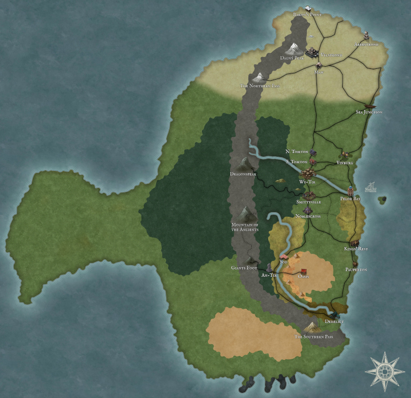

## The Maak Mountains
### Flora and Fauna
Queen's Flower: a small blue flower that grows high in the mountains. Named after Empress Consort Bethany, wife of Emperor Frederick (she preferred to be called "Queen").

## The North
The North sees long days in the summer and long nights in the winter. It is a land of snow and ice, where isolation and resiliance is a way of life.

Gothic is a dominant architectural style in the North.

Everything is just a little bit bigger in the North, including the humans.

### Geography
There is a lake in the North that stays frozen all year round due to the influence of a nearby magical stone structure. No one knows for sure why the lake is kept that way, but Northerners all know that it should not be disrupted.

There are multiple glaciers in the North.

### Religion
See Frostburn gods

### Flora and Fauna
- Giant polar bear (think giant short-faced bear)
- Saber tooth tiger
- Wooly mammoths
- Ground sloth
- Remorhaz

Vampires and the undead are more common in the North, perhaps because they are better preserved.

## The Middlelands
The core of the Empire. Mostly civilized, so ecology is largely influenced by humanoid life. Temperate forestland, cities, open fields.

### Flora and Fauna

Jewel Flower: A flower that looks like it's made out of gemstones. It grows very slowly and requires careful tending. It takes 25 years to bloom the first time, and then it blooms once very 11 years.

Night Jellyfish: A fabled creature that is said to float around the foothills. It gives off a sparkly blue glow.

## The Wildlands
This map was drawn by adventurer Kit Thornton for an Imperial audience, embracing the dismissive moniker "Southern Wildlands": <a href="https://www.dropbox.com/scl/fi/jffqqc6c1a7l3ons6byy5/Wildlands_Map.PNG?rlkey=3qr3wnk6hihm08jmhl066x7ii&dl=0&raw=1">Montrosia Map</a>

### Geography
The Steel River

The Steel River is a source of life for the Wildlands. Many species of fish can found in the Steel River, including River Frumps, Spotted Alaways, Bottle Trout, Striped Trout, Dinosaurfish, Pebble Fish, Sunfish, Rodfish (a.k.a. Water Birds).

The Steel River carries nutrient-rich soils from the foothills of the Maak Mountains to the river's mouth in Derelict. As it leaves the mountains and enters the plains, the river's passage slows and numerous meanders form. These slower regions create large wetlands in the valley between the Maak Mountains and the Backbone Mountains that are home to many different species. This prolific life attracts hunters and fishers. 
Montrosia

A wide variety of human tribes and settlements refer to those lush marshlands and verdant hills around The Steel River as Montrosia, united by their mutual cultural respect and dependency on the abundant animal life. Near the source of the river, a subset of this designation, Trepsalam, describes both the inhospitable swamp, and equally inhospitable people that live there. Parasitic insects, enormous reptiles and hostile vegetation make it a hard place to live, but the presence of demons, devils and disreputable magic users are what makes it taboo to other residents of Montrosia.
The Dark Scars

The Dark Scars are deep canyons amongst otherwise flat grasslands. This name comes from Meloi legends about an ancient war where an angry god  cut deeply into the land itself during battle.
The Petrified Forest

To the East of the Steel River lies a large forest of petrified trees. Not much live here and most people avoid it. Rumors abound that the condition of the tress is due to a curse put on the land long ago.
The Cloud Conifers

A forest of enormous trees stands out from the surrounding grasslands. Some of the biggest specimens are called God-conifers by the indigenous wood elves that protect them. 

### Dinosaurs

Dinosaurs dominate the area called the "Wildlands", which lends to the popularity of the term in the Imperial North

Many different types, some herded by the humanoid population, but even more roam wild
- Kalelani drovers a famous for training beasts of burden like ceratopsians, sauropods.
- Meloi nomads keeps vast herds of cattle, like gallimimus for food, particularly eggs.
- Large raptor and even theropods as military mounts.

On the proliferation of dinosaur species:
- Widespread campaigns of dinosaur hunters funded by the Empire drove extinctions in the North.
- Domestication  and conservation by "barbarian" nations which value them economically and culturally.

### Politics
Kalelani

The name for the confederation under a monarchic control at the fortress Helmhold. The Kalelani have been in control of this loose government for many generations, but control over the ostensive capital connotes authority, hence the name "Helmhold", referring to the crown of the King. Tithes or food and labor are collected in exchange for military protection and sometime the esteemed service of well-trained dinosaur drovers.

Meloi

Varied Meloi tribes have in common a nomadic lifestyle herding dinosaurs and strict religious customs associated with the Temple of the Covenant. This monastic order worships a living figure called The Lord Messenger, the suppossed reincarnation of an ancient hero the unified the people and animals to fend of colonizing armies from the North.

Dragonkin Riverfolk

The nation of Lizardfolk that has spread proudly of recent years along the entirety of the Steel River proudly traces its ancestry to an ancient Red Dragon. The eponymous Dragon King has in recent years tried to pursue diplomatic relationships with the Kalelani and the Maak-Tir Empire, something the superstition of both powers complicates.